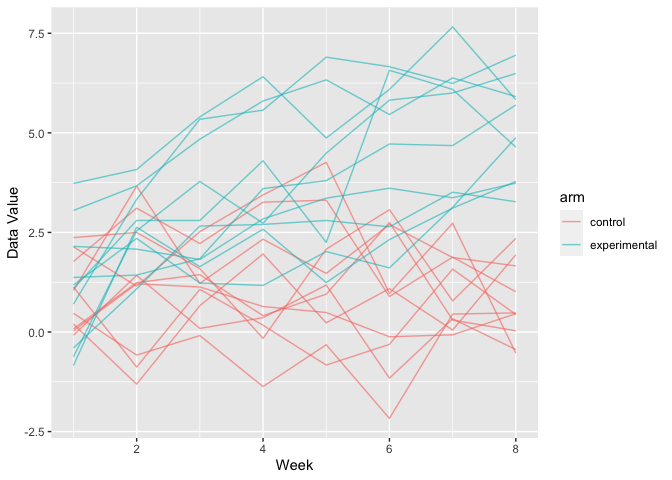

Data Science I Homework 5 - lzs2109
================
Louis Sharp
11/11/2021

``` r
library(tidyverse)
```

    ## ── Attaching packages ─────────────────────────────────────── tidyverse 1.3.1 ──

    ## ✓ ggplot2 3.3.5     ✓ purrr   0.3.4
    ## ✓ tibble  3.1.4     ✓ dplyr   1.0.7
    ## ✓ tidyr   1.1.3     ✓ stringr 1.4.0
    ## ✓ readr   2.0.1     ✓ forcats 0.5.1

    ## ── Conflicts ────────────────────────────────────────── tidyverse_conflicts() ──
    ## x dplyr::filter() masks stats::filter()
    ## x dplyr::lag()    masks stats::lag()

### **Problem 1**

``` r
homicide_df = read_csv("./data/homicide-data.csv") %>% 
  mutate(city_state = str_c(city, state, sep = ", "),
         status = ifelse(disposition == "Closed by arrest", "solved", "unsolved"))
```

    ## Rows: 52179 Columns: 12

    ## ── Column specification ────────────────────────────────────────────────────────
    ## Delimiter: ","
    ## chr (9): uid, victim_last, victim_first, victim_race, victim_age, victim_sex...
    ## dbl (3): reported_date, lat, lon

    ## 
    ## ℹ Use `spec()` to retrieve the full column specification for this data.
    ## ℹ Specify the column types or set `show_col_types = FALSE` to quiet this message.

The raw data from homicide-data.csv contains the variables uid,
reported\_date, victim\_last, victim\_first, victim\_race, victim\_age,
victim\_sex, city, state, lat, lon, disposition, city\_state, status,
which give ID numbers to each homicide, in addition to the date,
victim’s information, the location (city, state, and specific
latitude/longitude) of the homicide, and finally the status of the case
(closed/open/arrest/no arrest). There are 51 cities and a total of 52179
homicides with data included in the dataset.

``` r
homicide_df %>% 
  group_by(city_state, status) %>% 
  count()
```

    ## # A tibble: 101 × 3
    ## # Groups:   city_state, status [101]
    ##    city_state      status       n
    ##    <chr>           <chr>    <int>
    ##  1 Albuquerque, NM solved     232
    ##  2 Albuquerque, NM unsolved   146
    ##  3 Atlanta, GA     solved     600
    ##  4 Atlanta, GA     unsolved   373
    ##  5 Baltimore, MD   solved    1002
    ##  6 Baltimore, MD   unsolved  1825
    ##  7 Baton Rouge, LA solved     228
    ##  8 Baton Rouge, LA unsolved   196
    ##  9 Birmingham, AL  solved     453
    ## 10 Birmingham, AL  unsolved   347
    ## # … with 91 more rows

``` r
bmore = 
  homicide_df %>%
    filter(city_state == "Baltimore, MD") %>%
    group_by(status) %>% 
    count()
bmore = prop.test(x = bmore$n[2], n = bmore$n[1] + bmore$n[2])
bmore %>% 
  broom::tidy() %>% 
  select(estimate, conf.low, conf.high)
```

    ## # A tibble: 1 × 3
    ##   estimate conf.low conf.high
    ##      <dbl>    <dbl>     <dbl>
    ## 1    0.646    0.628     0.663

``` r
unsolved_murders = function(location) {
  
  city = homicide_df %>% 
           filter(city_state == location) %>%
           group_by(status) %>% 
           count()
  
  city = prop.test(x = city$n[2], n = city$n[1] + city$n[2])
  
  city %>% 
    broom::tidy() %>% 
    select(estimate, conf.low, conf.high)
  
}

unsolved_murders("Atlanta, GA")
```

    ## # A tibble: 1 × 3
    ##   estimate conf.low conf.high
    ##      <dbl>    <dbl>     <dbl>
    ## 1    0.383    0.353     0.415

``` r
homicide_df %>% 
  group_by(city_state, status) %>% 
  count()
```

    ## # A tibble: 101 × 3
    ## # Groups:   city_state, status [101]
    ##    city_state      status       n
    ##    <chr>           <chr>    <int>
    ##  1 Albuquerque, NM solved     232
    ##  2 Albuquerque, NM unsolved   146
    ##  3 Atlanta, GA     solved     600
    ##  4 Atlanta, GA     unsolved   373
    ##  5 Baltimore, MD   solved    1002
    ##  6 Baltimore, MD   unsolved  1825
    ##  7 Baton Rouge, LA solved     228
    ##  8 Baton Rouge, LA unsolved   196
    ##  9 Birmingham, AL  solved     453
    ## 10 Birmingham, AL  unsolved   347
    ## # … with 91 more rows

## Problem 2

``` r
hw5_df = 
  tibble(
  filenames = list.files("data/hw5_data/"),
  location = str_c("./data/hw5_data/", filenames),
  data = map(location, read_csv)
) %>% 
  mutate(filenames = str_remove(filenames, ".csv$")) %>% 
  rename(treatment = filenames) %>% 
  unnest() %>% 
  select(-location) %>% 
  pivot_longer(week_1:week_8, 
               names_to = "week", 
               names_prefix = "week_", 
               values_to = "data_value") %>% 
  mutate(week = as.numeric(week))

hw5_df %>% 
  ggplot(aes(x = week, y = data_value, color = treatment)) +
  geom_line(alpha = 0.6)
```

<!-- -->
