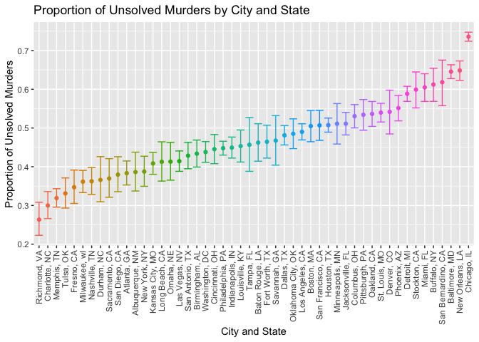

Data Science I Homework 5 - lzs2109
================
Louis Sharp
11/11/2021

``` r
library(tidyverse)
```

### **Problem 1**

``` r
homicide_df = read_csv("./data/homicide-data.csv") %>% 
  mutate(city_state = str_c(city, state, sep = ", "),
         status = ifelse(disposition == "Closed by arrest", "solved", "unsolved"))
```

    ## Rows: 52179 Columns: 12

    ## ── Column specification ────────────────────────────────────────────────────────
    ## Delimiter: ","
    ## chr (9): uid, victim_last, victim_first, victim_race, victim_age, victim_sex...
    ## dbl (3): reported_date, lat, lon

    ## 
    ## ℹ Use `spec()` to retrieve the full column specification for this data.
    ## ℹ Specify the column types or set `show_col_types = FALSE` to quiet this message.

The raw data from homicide-data.csv contains the variables uid,
reported\_date, victim\_last, victim\_first, victim\_race, victim\_age,
victim\_sex, city, state, lat, lon, disposition, city\_state, status,
which give ID numbers to each homicide, in addition to the date,
victim’s information, the location (city, state, and specific
latitude/longitude) of the homicide, and finally the status of the case
(closed/open/arrest/no arrest). There are 51 cities and a total of 52179
homicides with data included in the dataset.

``` r
homicide_df %>% 
  group_by(city_state, status) %>% 
  count()
```

    ## # A tibble: 101 × 3
    ## # Groups:   city_state, status [101]
    ##    city_state      status       n
    ##    <chr>           <chr>    <int>
    ##  1 Albuquerque, NM solved     232
    ##  2 Albuquerque, NM unsolved   146
    ##  3 Atlanta, GA     solved     600
    ##  4 Atlanta, GA     unsolved   373
    ##  5 Baltimore, MD   solved    1002
    ##  6 Baltimore, MD   unsolved  1825
    ##  7 Baton Rouge, LA solved     228
    ##  8 Baton Rouge, LA unsolved   196
    ##  9 Birmingham, AL  solved     453
    ## 10 Birmingham, AL  unsolved   347
    ## # … with 91 more rows

``` r
bmore = 
  homicide_df %>%
  filter(city_state == "Baltimore, MD") %>%
  group_by(status) %>% 
  count()

bmore = prop.test(x = bmore$n[2], n = bmore$n[1] + bmore$n[2])

bmore %>% 
  broom::tidy() %>% 
  select(estimate, conf.low, conf.high)
```

    ## # A tibble: 1 × 3
    ##   estimate conf.low conf.high
    ##      <dbl>    <dbl>     <dbl>
    ## 1    0.646    0.628     0.663

``` r
unsolved_murders = function(location) {
  
  city = homicide_df %>% 
           filter(city_state == location) %>%
           group_by(status) %>% 
           count()
  
  city = prop.test(x = city$n[2], n = city$n[1] + city$n[2])
  
  city %>% 
    broom::tidy() %>% 
    select(estimate, conf.low, conf.high)
  
}

unsolved_murders("Atlanta, GA")
```

    ## # A tibble: 1 × 3
    ##   estimate conf.low conf.high
    ##      <dbl>    <dbl>     <dbl>
    ## 1    0.383    0.353     0.415

``` r
unsolved_murders("San Francisco, CA")
```

    ## # A tibble: 1 × 3
    ##   estimate conf.low conf.high
    ##      <dbl>    <dbl>     <dbl>
    ## 1    0.507    0.468     0.545

``` r
city_states = 
  homicide_df %>% 
  nest(cols = -city_state) %>% 
  select(city_state) %>% 
  filter(city_state != "Tulsa, AL") %>% 
  pull()                                      
  
#had to remove Tulsa, AL as it did not have appropriate data (1 solved, no unsolved)

unsolved_murders_df = 
  tibble(
    city_state = city_states,
    prop_unsolved = map(city_state, unsolved_murders)
  ) %>% 
  unnest() %>% 
  mutate(city_state = fct_reorder(city_state, estimate))
```

    ## Warning: `cols` is now required when using unnest().
    ## Please use `cols = c(prop_unsolved)`

``` r
head(unsolved_murders_df)
```

    ## # A tibble: 6 × 4
    ##   city_state      estimate conf.low conf.high
    ##   <fct>              <dbl>    <dbl>     <dbl>
    ## 1 Albuquerque, NM    0.386    0.337     0.438
    ## 2 Atlanta, GA        0.383    0.353     0.415
    ## 3 Baltimore, MD      0.646    0.628     0.663
    ## 4 Baton Rouge, LA    0.462    0.414     0.511
    ## 5 Birmingham, AL     0.434    0.399     0.469
    ## 6 Boston, MA         0.505    0.465     0.545

``` r
unsolved_murders_df %>% 
  ggplot(aes(x = city_state, y = estimate, color = city_state)) +
  geom_point() +
  geom_errorbar(aes(x = city_state, ymin = conf.low, ymax = conf.high)) +
  coord_flip() +
  theme(legend.position = "none")
```

<!-- -->

## Problem 2

``` r
hw5_df = 
  tibble(
  filenames = list.files("data/hw5_data/"),
  location = str_c("./data/hw5_data/", filenames),
  data = map(location, read_csv)
) %>% 
  mutate(filenames = str_remove(filenames, ".csv$")) %>% 
  rename(treatment = filenames) %>% 
  unnest() %>% 
  pivot_longer(week_1:week_8, 
               names_to = "week", 
               names_prefix = "week_", 
               values_to = "data_value") %>% 
  mutate(week = as.numeric(week),
         group = ifelse(str_detect(treatment, "^con"), "control", "treatment"),
         subject_id = str_remove(treatment, "^con_"),
         subject_id = str_remove(subject_id, "^exp_")) %>% 
  select(treatment, subject_id, group, week, data_value)
  

hw5_df %>% 
  ggplot(aes(x = week, y = data_value, color = group)) +
  geom_line(aes(group = treatment), alpha = 0.6)
```

<!-- -->

Based on the spaghetti plot, we can see that by the end of week 8, all
subjects in the control arm have a lower data value than all subjects in
the treatment group. If the treatment was meant to increase the data
value, it appears to be effective in all subjects, including those that
had lower starting data values than subjects in the control group.

## Problem 3

``` r
library(tidyverse)

set.seed(10)

iris_with_missing = iris %>% 
  map_df(~replace(.x, sample(1:150, 20), NA)) %>%
  mutate(Species = as.character(Species))
```

Function that takes a vector and replaces missing values below.

``` r
#vec_char = c("douglasiana", "innominata", "macrosiphon", NA, NA, "tenax", NA)
#vec_num = c(3, 7, 23, NA, 74, NA, 52, NA, NA)

na_replacer = function(vec) {
  
  if (is.character(vec)) {
    vec = replace_na(vec, "virginica")
  } else if (is.numeric(vec)) {
    vec = replace_na(vec, mean(vec, na.rm = TRUE))
  }
  vec
}

#na_replacer(vec_char) #testing function on character vector
#na_replacer(vec_num) #testing function on numeric vector 
```

Now map this function over the columns of iris\_with\_missing data
frame.

``` r
iris_without_missing = 
  map(iris_with_missing, na_replacer) %>% 
  as.data.frame()
head(iris_without_missing, 12)
```

    ##    Sepal.Length Sepal.Width Petal.Length Petal.Width Species
    ## 1      5.100000    3.500000     1.400000    0.200000  setosa
    ## 2      4.900000    3.000000     1.400000    0.200000  setosa
    ## 3      4.700000    3.200000     1.300000    0.200000  setosa
    ## 4      4.600000    3.100000     1.500000    1.192308  setosa
    ## 5      5.000000    3.600000     1.400000    0.200000  setosa
    ## 6      5.400000    3.900000     1.700000    0.400000  setosa
    ## 7      5.819231    3.400000     1.400000    0.300000  setosa
    ## 8      5.000000    3.400000     1.500000    0.200000  setosa
    ## 9      4.400000    2.900000     1.400000    0.200000  setosa
    ## 10     4.900000    3.100000     3.765385    0.100000  setosa
    ## 11     5.400000    3.075385     1.500000    0.200000  setosa
    ## 12     4.800000    3.400000     1.600000    0.200000  setosa

``` r
map(iris_with_missing, ~sum(is.na(.))) #check number of NAs before using map function
```

    ## $Sepal.Length
    ## [1] 20
    ## 
    ## $Sepal.Width
    ## [1] 20
    ## 
    ## $Petal.Length
    ## [1] 20
    ## 
    ## $Petal.Width
    ## [1] 20
    ## 
    ## $Species
    ## [1] 20

``` r
map(iris_without_missing, ~sum(is.na(.))) # ..and after using map function
```

    ## $Sepal.Length
    ## [1] 0
    ## 
    ## $Sepal.Width
    ## [1] 0
    ## 
    ## $Petal.Length
    ## [1] 0
    ## 
    ## $Petal.Width
    ## [1] 0
    ## 
    ## $Species
    ## [1] 0
